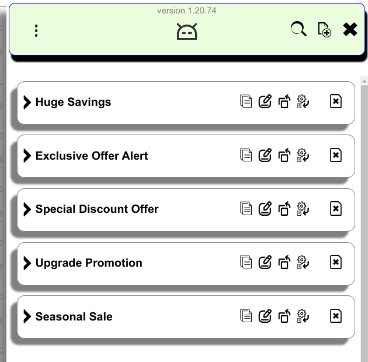
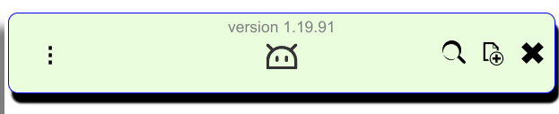
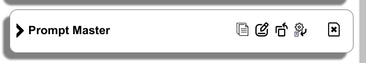

## UI

### Main View



### Main Menu


The snippet list can be `Export`ed and `Import`ed from here. The `Options` page is also available here apart from the stadard Extension page interface.

#### Top Ribbon



On the left is the main menu ().

On the right-hand side, from right to left, are:
* Close button (  )
* New item button (  )
* Search button (  )

#### Search to filter


## Cards



The elements from left to right are:

---

* Expand/Collapse button (  )


---

* Title - a free descriptive text giving a hint what the card contains
* Copy button (  )

---

* Edit button (  )

`Save` (  ), `Cancel` (  ) or `Skipt` (  ) to the next will be available when edit mode is active.

One can edit the title ...


or the body.


---

* Put into button (  ) - copies content and allow pasting it into any element with left click.

* Send to button (  ) - sends content to the  first found suitable element - usually textarea or input type text.

**Note:** This will try to insert the body of the card into recognizable input or active elements that accept user input. As feasible targets are text inputs, textareas, and elements with set contenteditable attribute. (*see the next item for more information*)

---

* Send to and Run button (  )


**Note 1:** This is tested and expected to work only with AI Web interfaces. (*See next Note 2*)

**Note 2:** Currently ChatGPT, Gemini (Google) and You.com are supported. There is a chance for similar web services using a `textarea` for the user input to work as well.

---

* Delete button (  )


## Options


* `Show Embedded Button` controls the visibility of the button, which typically appears in the middle of the browser's right edge.
* `Close Sidebar When Click Outside` determines the behavior when clicking outside the panel.
* `Close After Send To` manages the panel's behavior after sending something, typically followed by actions outside the panel.
* `Close Sidebar After Copy` functions similarly to the above but activates after clicking the copy button.

### Allowed Urls:


* When empty or if the first line is `*`, it indicates that the extension can be used on any page without restrictions.
* This box may contain a list of full or partial domains separated by semicolons (`;`), commas (`,`), or placed on new lines (one domain per line).

The latter configuration will allow the extension to operate only on sites that match any domain from the list. The list does not support regular expressions or other types of filters. You may experiment, but it is generally expected that the domain names in the list consist of two or three parts like:

```
google.com
translate.google.com
```

### Other buttons


Additional options are available for importing, exporting, and backing up data.

**Note:** Only one backup can be stored at a time, and any new backup will replace the existing one."
