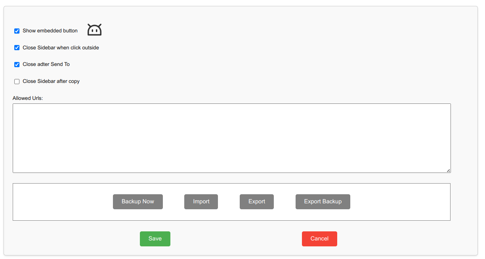

# AI Prompt Repo vesion 1.19.97

The original idea was to maintain a set of predefined ChatGPT prompts that could be used as is or with minor modifications to suit the flow. However, it became apparent that various contexts required the inclusion of some recurring static information, leading to a slight expansion of the functionality. For more details, see the Options section.

## UI

### Main Menu


The snippet list can be `Export`ed and `Import`ed from here. The `Options` page is also available here apart from the stadard Extension page interface.

#### Top Ribbon


On the left is the main menu ().

On the right-hand side, from right to left, are the close button (), new item button (), and search button ().

## Options


* `Show Embedded Button` controls the visibility of the button, which typically appears in the middle of the browser's right edge.
* `Close Sidebar When Click Outside` determines the behavior when clicking outside the panel.
* `Close After Send To` manages the panel's behavior after sending something, typically followed by actions outside the panel.
* `Close Sidebar After Copy` functions similarly to the above but activates after clicking the copy button.

### Allowed Urls:

* When empty or if the first line is `*`, it indicates that the extension can be used on any page without restrictions.
* This box may contain a list of full or partial domains separated by semicolons (`;`), commas (`,`), or placed on new lines (one domain per line).

The latter configuration will allow the extension to operate only on sites that match any domain from the list. The list does not support regular expressions or other types of filters. You may experiment, but it is generally expected that the domain names in the list consist of two or three parts like:

```
google.com
translate.google.com
```

---

You may want to read the [Privacy Policy](others/pryvacy.md)